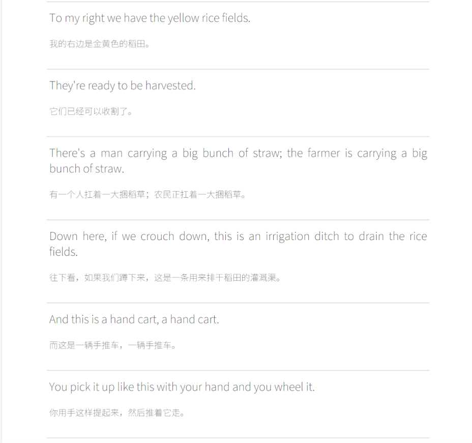

# YouTube English Learning PDF Generator

[](https://www.python.org/downloads/)
[](LICENSE)
[](extension/)

将 YouTube 视频字幕提取为中英双语 PDF，方便做笔记学英语。
便捷交互形式：通过安装为浏览器扩展的方式，点击扩展之后，自动将整理好的PDF下载到百度网盘，我就能在ipad上直接做笔记。



## ✨ 功能特点

- 🎬 **字幕提取** - 自动提取 YouTube 视频字幕（支持多语言）
- 🌐 **双语翻译** - 使用 DeepSeek AI 进行中英双语翻译
- 📄 **PDF 生成** - 生成美观的 PDF，方便打印和笔记
- 🌍 **Web 界面** - 提供 Streamlit 仪表板，操作更便捷
- 🧩 **Chrome 扩展** - 浏览器扩展，一键生成 PDF
- ☁️ **云端部署** - 支持 Railway 部署，随时随地使用

## 📸 截图

<!-- 如果有截图可以在这里添加 -->
```
┌─────────────────────────────────────────┐
│  📚 YouTube English Learner             │
│                                         │
│  ┌─────────────────────────────────┐    │
│  │ https://youtube.com/watch?v=... │    │
│  └─────────────────────────────────┘    │
│           [⚡ Generate]                 │
│                                         │
│  ✅ Learn English in the Supermarket    │
│     Comprehensible Input                │
│                                         │
│  ┌────────┬────────┬────────┐           │
│  │ 1,234  │   56   │  89 KB │           │
│  │ Words  │ Lines  │  Size  │           │
│  └────────┴────────┴────────┘           │
│           [📥 Download PDF]             │
└─────────────────────────────────────────┘
```

## 🚀 快速开始

### 1. 克隆项目

```bash
git clone https://github.com/yourusername/youtube-english-learner.git
cd youtube-english-learner
```

### 2. 安装依赖

```bash
pip install -r requirements.txt
```

### 3. 配置 API Key

复制 `.env.example` 为 `.env`，填入你的 API Key：

```bash
cp .env.example .env
```

编辑 `.env` 文件：

```env
# DeepSeek API Key (用于翻译)
# 获取地址: https://platform.deepseek.com/api_keys
DEEPSEEK_API_KEY=your_deepseek_api_key_here

# Supadata API Key (用于字幕提取)
# 获取地址: https://supadata.ai/
SUPADATA_API_KEY=your_supadata_api_key_here

# Gmail 邮箱 (可选 - 用于邮件发送)
GMAIL_ADDRESS=your_email@gmail.com
GMAIL_APP_PASSWORD=your_app_password_here
```

### 4. 运行程序

```bash
# 命令行模式
python main.py https://www.youtube.com/watch?v=VIDEO_ID

# 或交互式输入
python main.py

# Web 界面模式
streamlit run dashboard.py
```

## 📖 使用方法

### 命令行模式

```bash
# 直接传入 YouTube 链接
python main.py "https://www.youtube.com/watch?v=dQw4w9WgXcQ"

# 交互式输入
python main.py
# 提示: Enter YouTube URL: 
```

### Web 界面模式

```bash
streamlit run dashboard.py
```

访问 `http://localhost:8501`，粘贴 YouTube 链接即可生成 PDF。

### Chrome 扩展

1. 打开 Chrome，访问 `chrome://extensions/`
2. 开启"开发者模式"
3. 点击"加载已解压的扩展程序"
4. 选择 `extension` 文件夹
5. 在 YouTube 视频页面点击扩展图标

## 📁 项目结构

```
youtube-english-learner/
├── main.py              # 命令行入口
├── dashboard.py         # Streamlit Web 界面
├── get_transcripts.py   # 字幕提取模块
├── translate.py         # 翻译模块
├── generate_pdf.py      # PDF 生成模块
├── server.py            # Flask API 服务器
├── requirements.txt     # Python 依赖
├── .env.example         # 环境变量示例
├── output/              # 生成的 PDF 文件
└── extension/           # Chrome 扩展
    ├── manifest.json    # 扩展配置
    ├── background.js    # 后台脚本
    ├── content/         # 内容脚本
    │   ├── content.js
    │   └── content.css
    └── popup/           # 弹出窗口
        ├── popup.html
        ├── popup.css
        └── popup.js
```

## 📄 输出格式

生成的 PDF 格式：

- **英文** (14pt 加粗) - 原文字幕
- **空白行** - 方便做笔记
- **中文翻译** (11pt 灰色) - 翻译内容
- **分隔线** - 句子之间有分隔线和大留白

## 🛠️ 配置说明

### API Key 获取

| API | 用途 | 获取地址 |
|-----|------|----------|
| DeepSeek | AI 翻译 | https://platform.deepseek.com/api_keys |
| Supadata | 字幕提取 | https://supadata.ai/ |
| Gmail | 邮件发送 (可选) | https://myaccount.google.com/apppasswords |

### 环境变量

| 变量名 | 必需 | 说明 |
|--------|------|------|
| `DEEPSEEK_API_KEY` | ✅ | DeepSeek API 密钥 |
| `SUPADATA_API_KEY` | ✅ | Supadata API 密钥 |
| `GMAIL_ADDRESS` | ❌ | Gmail 邮箱地址 |
| `GMAIL_APP_PASSWORD` | ❌ | Gmail 应用专用密码 |

## 🌐 API 接口

如果部署为 API 服务，支持以下端点：

| 方法 | 路径 | 说明 |
|------|------|------|
| GET | `/api/health` | 健康检查 |
| POST | `/api/generate` | 生成 PDF |
| GET | `/api/download/{filename}` | 下载 PDF |
| GET | `/api/history` | 历史记录 |

## 🚢 部署

### Railway 部署

1. Fork 本项目
2. 在 [Railway](https://railway.app) 创建新项目
3. 连接 GitHub 仓库
4. 添加环境变量
5. 部署完成

### Docker 部署 (可选)

```dockerfile
FROM python:3.9-slim

WORKDIR /app
COPY requirements.txt .
RUN pip install -r requirements.txt

COPY . .
EXPOSE 5000

CMD ["gunicorn", "--bind", "0.0.0.0:5000", "server:app"]
```

## 🤝 贡献

欢迎提交 Issue 和 Pull Request！

1. Fork 本项目
2. 创建功能分支 (`git checkout -b feature/AmazingFeature`)
3. 提交更改 (`git commit -m 'Add some AmazingFeature'`)
4. 推送到分支 (`git push origin feature/AmazingFeature`)
5. 创建 Pull Request

## 📝 更新日志

### v1.0.1 (最新)
- ✅ 修复后台标签页生成中断问题
- ✅ 延长超时时间到 3 分钟
- ✅ 添加 keep-alive 机制
- ✅ 改进错误提示信息

### v1.0.0
- 🎉 初始版本发布
- ✅ 支持 YouTube 字幕提取
- ✅ 中英双语翻译
- ✅ PDF 生成和下载
- ✅ Chrome 扩展支持

## 📄 许可证

本项目采用 MIT 许可证 - 详见 [LICENSE](LICENSE) 文件

## 🙏 致谢

- [DeepSeek](https://platform.deepseek.com/) - AI 翻译服务
- [Supadata](https://supadata.ai/) - 字幕提取服务
- [fpdf2](https://py-pdf.github.io/fpdf2/) - PDF 生成库
- [Streamlit](https://streamlit.io/) - Web 界面框架

## 📧 联系方式

如有问题或建议，请通过以下方式联系：

- 提交 [Issue](https://github.com/yourusername/youtube-english-learner/issues)
- 发送邮件至 2245269601@qq.com

---

⭐ 如果这个项目对你有帮助，请给个 Star 支持一下！